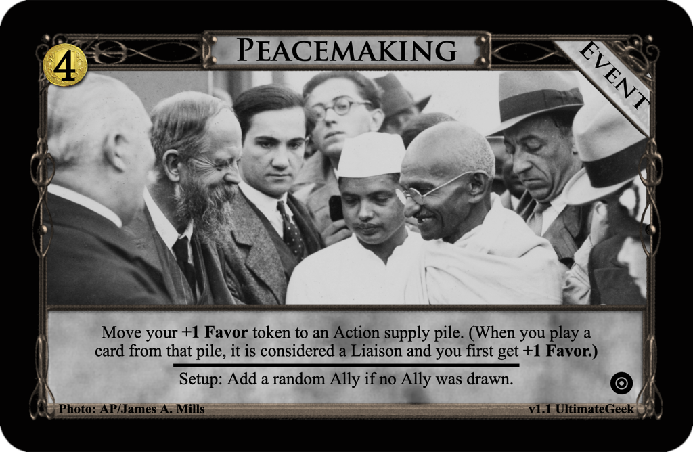
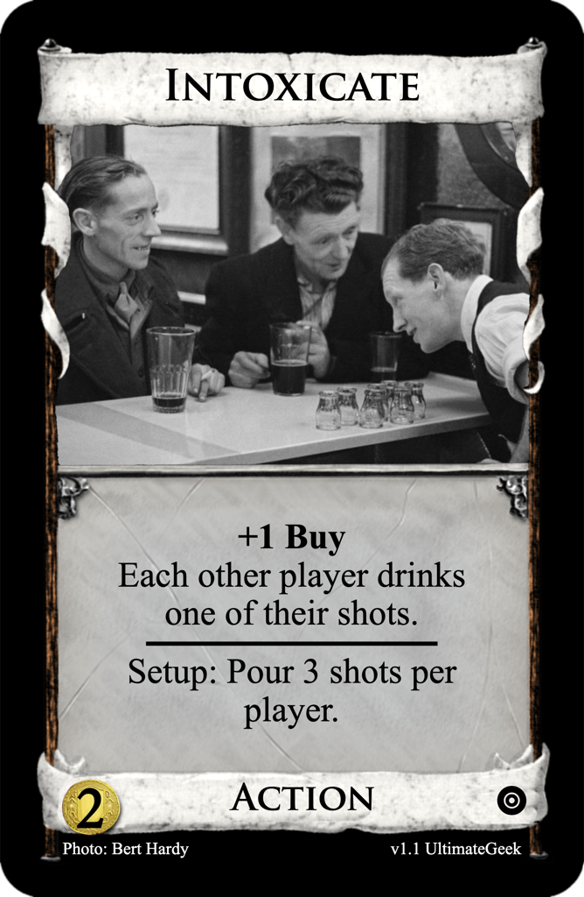
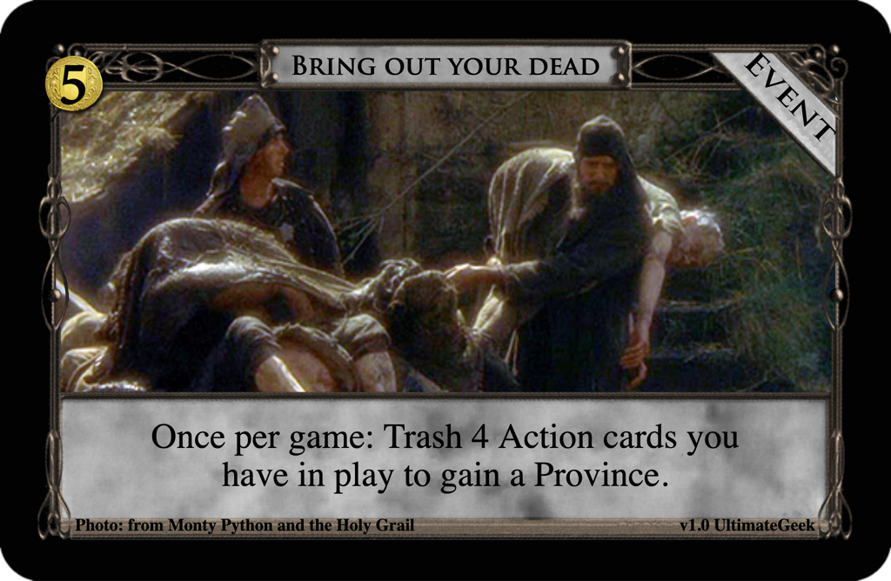
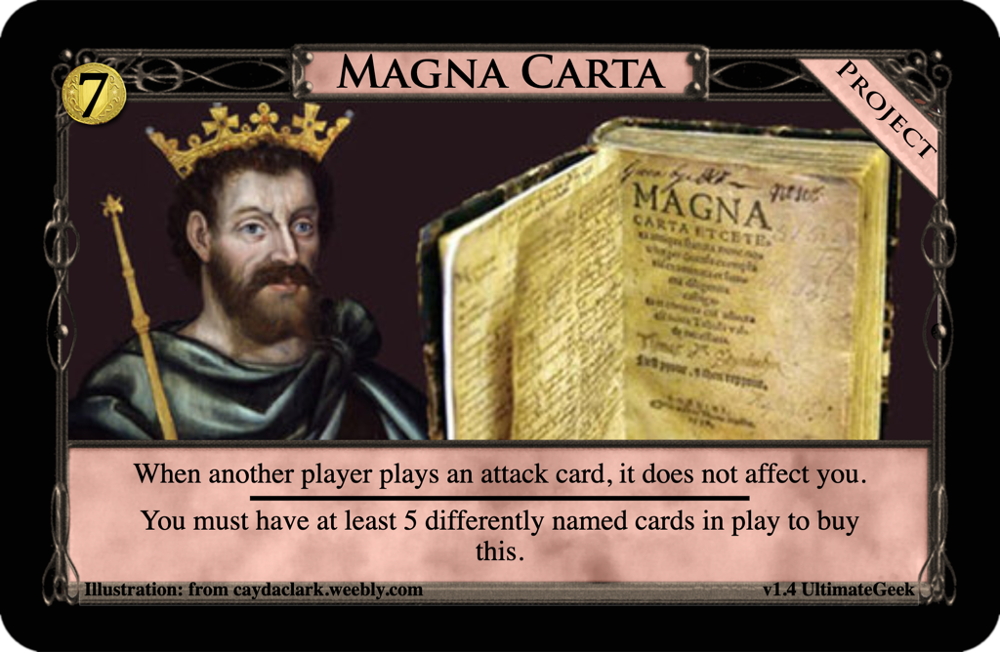

# Design Contests
Submissions to the Dominion Strategy Forum board
[Weekly Design Contest](http://forum.dominionstrategy.com/index.php?board=74.0).

Newest submissions are listed first.

## Weekly Design Contest #147: Target Demographic
Design an Ally.

### [Circle of Mages](circle-of-mages)

## Weekly Design Contest 146: Contacts
Design a Liaison.

### [Peacemaking](peacemaking)

## Weekly Design Contest 145: Down the hatch!
Design a card that thematically lends itself to alcohol.

### [Intoxicate](intoxicate)

## Weekly Design Contest #144: A one time thing
Design a card (shaped thing) with an effect that can only be used once per game.

### [Bring out your dead](bring-out-your-dead)

## Weekly Design Contest #143: Can I see your ID first?
Design a card(-shaped object) with a buying or gaining restriction.

### [Magna Carta](magna-carta)

