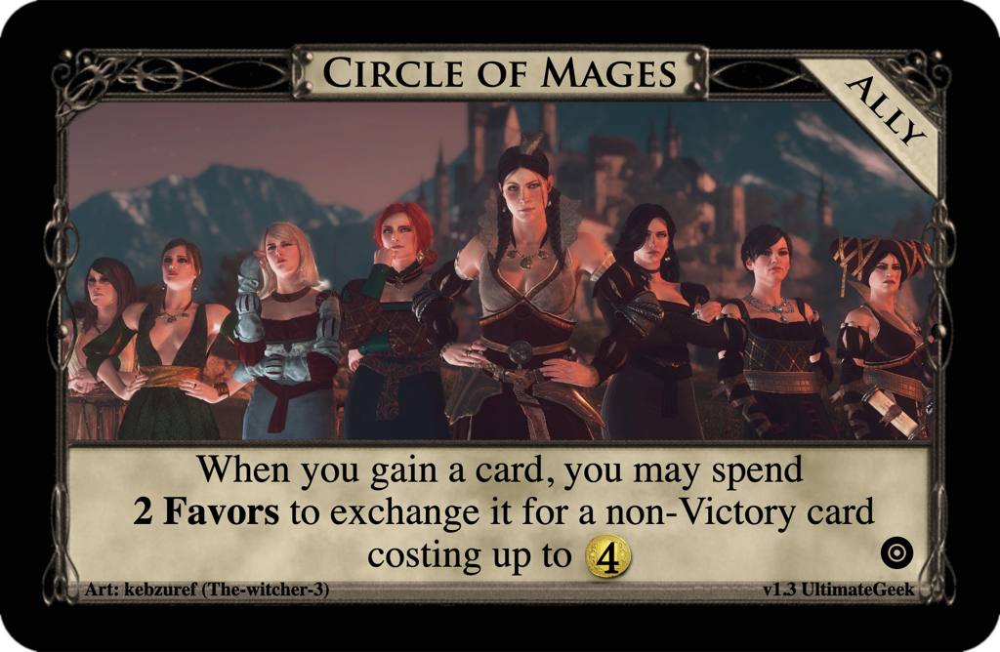

# Design Contests
Submissions to the Dominion Strategy Forum board
[Weekly Design Contest](http://forum.dominionstrategy.com/index.php?board=74.0).

Newest submissions are listed first.

## Weekly Design Contest #147: Target Demographic
[Contest by spineflu, 2022 March 28](http://forum.dominionstrategy.com/index.php?topic=21156.0)

> Well, we designed a liaison. Let's do the other one, design an Ally.
>
> No kingdom/non-supply piles, please, and do try to limit the number of Other Components I'd need to drag out - I'm already getting coin tokens and mats, I don't want to be getting Other Mats.
>
> If you need to include other types, in the interest of keeping your card readable without me getting my reading glasses out, consider using the "Heirloom" portion of the card generator to add additional types.
>
> All that said, I'm not going to be disqualifying any entries, because that felt really bad the last time I had hard limits on parameters, so just, do your best.

## [Circle of Mages](circle-of-mages)

