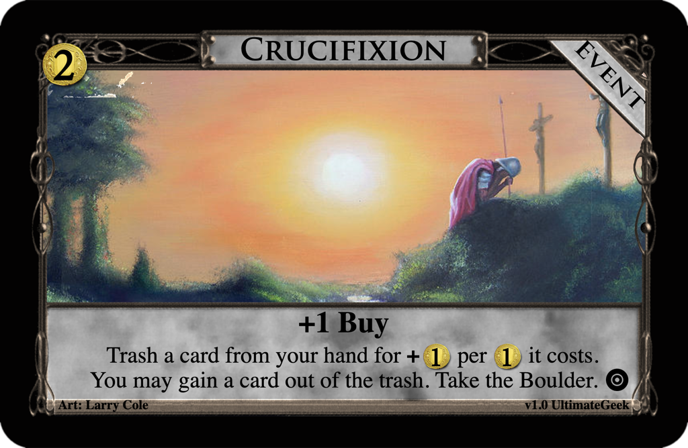
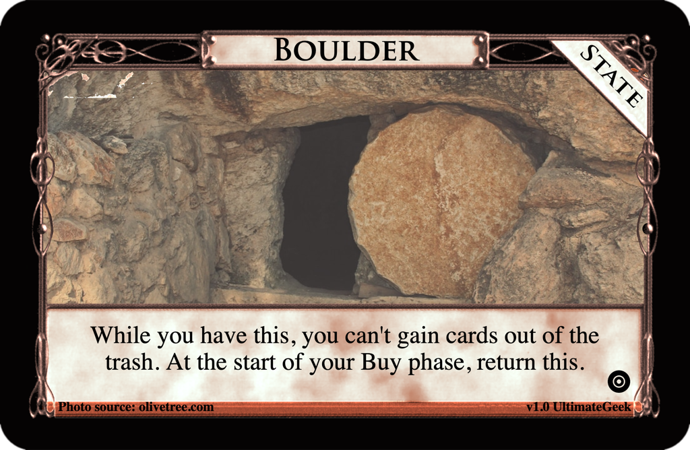

# Crucifixion
Post: [Weekly Design Contest #149: The Resurrection](http://forum.dominionstrategy.com/index.php?topic=21181.0)
by 4est, 2022 April 14

> With Good Friday and Easter right around the corner, I've got Resurrection on my mind. So here's this week's challenge:
>
> *Design a card or landscape that can retrieve another card (or itself) out of the Trash.*
>
> Acceptable submissions include:
> * Cards that can gain other cards from the Trash, such as Lurker, Graverobber, Rogue, or Treasurer
> * Cards with when-trash clauses that pull themselves back out of the Trash, such as Fortress or Lich.
> * Trashing Attacks that trash and then "steal" from trashed cards, such as Noble Brigand or the now removed Thief.
> * Any other creative idea you can come up with that can "resurrect" trashed cards.

> Other rules and suggestions:
> * Your entry must somehow facilitate moving a previously trashed card out of the Trash.
> * It doesn't necessarily have to be gained, or even return to a player. Returning trashed cards to the Supply or somewhere else is acceptable.
> * Cards that can gain copies of themselves when trashed (like Acolyte) or otherwise trash themselves into other cards (like Urchin or Hermit) will not be accepted.
> * Cards that only play other cards from the Trash but do not cause them to leave the Trash, such as Necromancer, will not be accepted.
> * Be sure to consider how cards might get into the Trash as not every Kingdom has a trasher. Notice that Lurker, Graverobber, Rogue, and Treasurer all have the ability to trash other cards. Fortress and Lich do not, though they still have utility apart from their when-trash clauses.
> * I will accept split piles or non-Supply cards as part of your submission, just try to keep things to no more than two cards if possible.
> * Also think about card interactions, particularly trash-for-benefit cards. Obviously these tend to play quite nicely with these sorts of cards, but be wary of making something that's too busted. (Although I guess there's plenty of crazy official stuff down this road already, ahem looking at you, Lurker + Hunting Grounds).
> * Don't make me squint. Eliminate unnecessary words and complexity where possible.
>
> Judgement Details:
> * Entries and revisions must be submitted by 5:00 PM CDT (10:00 PM UTC) on Friday, April 22. I'll have results posted on Sunday, April 24.
> * Entries will be judged on ingenuity, balance, simplicity, and creative/appropriate use of the "resurrection" mechanic.
>
> Have fun! With trashing historically always feeling like a very permanent act in Dominion, things like Fortress, Graverobber, and Lurker broke my brain when they were released, and I love the way they change up the game. There's a variety of directions people can go this week and I'm excited to see your designs!

## Submission: Crucifixion

### [$2 Event: Crucifixion](https://shardofhonor.github.io/dominion-card-generator/?title=Crucifixion&description=%2B1%20Buy%0ATrash%20a%20card%20from%20your%20hand%20for%20%2B%241%20per%20%241%20it%20costs.%20You%20may%20gain%20a%20card%20out%20of%20the%20trash.%20Take%20the%20Boulder.&type=Event&credit=Art%3A%20Larry%20Cole&creator=v1.0%20UltimateGeek&price=%242&preview=&type2=&color2split=1&boldkeys=&picture-x=0.39&picture-y=0.68&picture-zoom=1.2&picture=https%3A%2F%2Fimages.fineartamerica.com%2Fimages%2Fartworkimages%2Fmediumlarge%2F1%2Fsoldier-at-the-cross-larry-cole.jpg&expansion=https%3A%2F%2Fcdn4.iconfinder.com%2Fdata%2Ficons%2Fionicons%2F512%2Ficon-disc-512.png&custom-icon=&color0=0&color1=0&size=1)

> +1 Buy
> Trash a card from your hand for +$1 per $1 it costs. You may gain a
> card out of the trash. Take the Boulder.

### [State: Boulder](https://shardofhonor.github.io/dominion-card-generator/?title=Boulder&description=While%20you%20have%20this%2C%20you%20can%27t%20gain%20cards%20out%20of%20the%20trash.%20At%20the%20start%20of%20your%20Buy%20phase%2C%20return%20this.%0A&type=State&credit=Photo%20source%3A%20olivetree.com&creator=v1.0%20UltimateGeek&price=&preview=&type2=&color2split=1&boldkeys=&picture-x=-0.73&picture-y=0.68&picture-zoom=1.2&picture=https%3A%2F%2Fwww.olivetree.com%2Fblog%2Fwp-content%2Fuploads%2F2018%2F02%2FSealingTheTombSocialNoText-1.jpg&expansion=https%3A%2F%2Fcdn4.iconfinder.com%2Fdata%2Ficons%2Fionicons%2F512%2Ficon-disc-512.png&custom-icon=&color0=13&color1=0&size=1)

> While you have this, you can't gain cards out of the trash.
> At the start of your Buy phase, return this.

