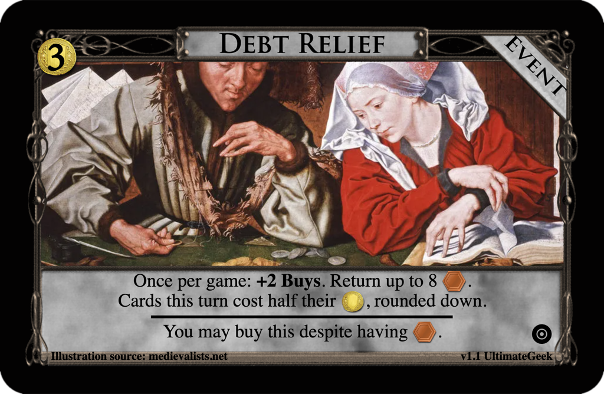

# Debt Relief
Post: [Weekly Design Contest #150: Half!](http://forum.dominionstrategy.com/index.php?topic=21192.0)
by JW, 2022 Apr 25

> *Design a card or landscape that contains the word or concept of "half" (or its equivalent). Sample card: Bishop.*
>
> *Other rules and suggestions (adapted from 4est's previous contests):*
> "Per $2 it costs", "Divided by 2," "halved", etc. are all acceptable wordings.
> I will accept heirlooms, artifacts, split piles, non-Supply cards etc., as part of your submission, but keep things to no more than two cards/landscapes.
> Don't make me squint. Eliminate unnecessary words and complexity where possible.
>
> *Judgement Details:*
> Entries and revisions must be submitted by just before midnight UTC on Monday, May 2. I'll try to have results posted the next day.
> Entries will be judged on ingenuity, balance, simplicity, and creative/appropriate use of the concept of "half."

## Submission: Debt Collection
### [$3 Event: Debt Relief](https://shardofhonor.github.io/dominion-card-generator/?title=Debt%20Relief&description=Once%20per%20game%3A%20%2B2%20Buys.%20Return%20up%20to%208%20%40.%0ACards%20this%20turn%20cost%20half%20their%20%24%2C%20rounded%20down.%0A%20-%0AYou%20may%20buy%20this%20despite%20having%20%40.%0A&type=Event&credit=Illustration%20source%3A%20medievalists.net&creator=v1.1%20UltimateGeek&price=%243&preview=&type2=&color2split=19&boldkeys=&picture-x=-0.79&picture-y=-0.34&picture-zoom=1&picture=https%3A%2F%2Fi2.wp.com%2Fwww.lostkingdom.net%2Fwp-content%2Fuploads%2F2017%2F01%2Fmoney_beauty04-26faf1c5c7a127bcb865d66d0232c3528dc18365-s900-c85.jpg%3Ffit%3D900%252C663%26ssl%3D1&expansion=https%3A%2F%2Fcdn4.iconfinder.com%2Fdata%2Ficons%2Fionicons%2F512%2Ficon-disc-512.png&custom-icon=&color0=0&color1=1&size=1)

> Once per game: +2 Buys. Return up to 8 @.
> Cards this turn cost half their $, rounded down.
> ___
> You may buy this despite having @.

## Review
by JW

> A good use of a once-per game effect. Having a one-time event be a "must buy" seems like less of an issue than it would be on a Kingdom card as long as it doesn't completely transform your deck and eliminate much of the chance from the game (see: Donate). I believe that, most of the time, "double your $" would have the same impact though there are plenty of exceptions like Ball or Horn of Plenty, which offer nice interactions. **Short list.**

Awarded an Honorable mention.
