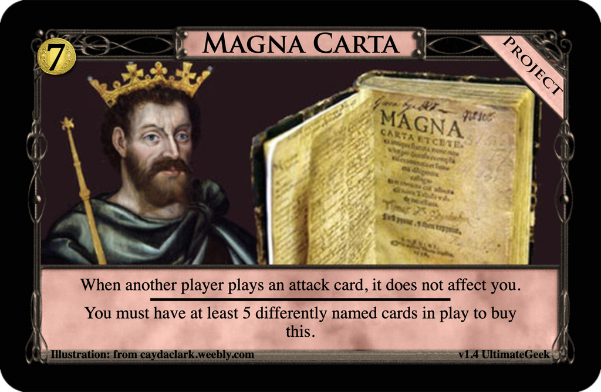

# Magna Carta
Post: [Weekly Design Contest #143: Can I see your ID first?](http://forum.dominionstrategy.com/index.php?topic=21072.0)
by faust, 2022 February 16

> This week, your task is to **design a card(-shaped object) with a buying or gaining restriction.**
>
> The inspiration for this contest is Grand Market. However, once-per-turn or once-per-game Events like Alms or Seize the Day would also be valid.
>
> Here are some more precise rules:
> - your submission should have some additional requirement to being bought/gained other than cost.
> - if your submission is a card, it should be in the supply; a gaining restriction due to not being in the supply will not be valid. You may still involve non-supply cards.
> - the restriction does not need to be explicitly stated as it is on Grand Market, so long as it has an analogous effect.
>
> Obviously there is some room for interpretation, and I will try to be generous if it is in the spirit of the contest. Please be mindful of potential rules issues with a condition like "You may not gain this unless...".

## Submission: [$7 Project: Magna Carta](https://shardofhonor.github.io/dominion-card-generator/?title=Magna%20Carta&description=When%20another%20player%20plays%20an%20attack%20card%2C%20it%20does%20not%20affect%20you.%0A-%0AYou%20must%20have%20at%20least%205%20differently%20named%20cards%20in%20play%20to%20buy%20this.&type=Project&credit=Illustration%3A%20from%20caydaclark.weebly.com&creator=v1.4%20UltimateGeek&price=%247&preview=&type2=&color2split=1&boldkeys=&picture-x=0&picture-y=0.57&picture-zoom=1&picture=https%3A%2F%2Fcaydaclark.weebly.com%2Fuploads%2F3%2F1%2F1%2F5%2F3115720%2F__4761746.jpg&expansion=&custom-icon=&color0=15&color1=0&size=1)

> When another player plays an attack card, it does not affect you.
> <pre>--</pre>
> You must have at least 5 differently named cards in play to buy this.

## Review
by faust

> I agree with comments calling this too expansive; Attacks hit hardest in the early game and that's when you won't be able to get this. In order to satisfy the requirements you already need to be able to deal with any attacks, so at that point, what do you even need this for?  
> What's more I don't think straight up blocking attacks is a very interesting design space to begin with.

Not selected.
