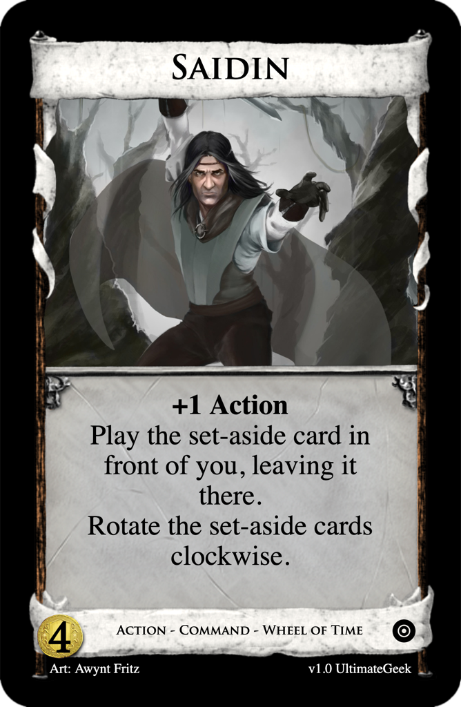
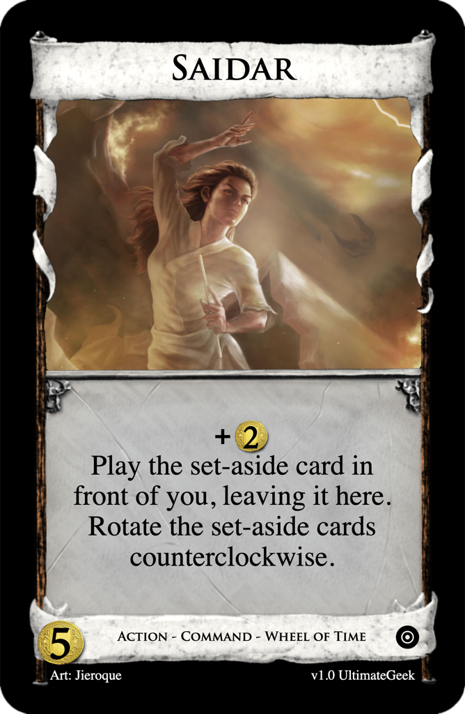
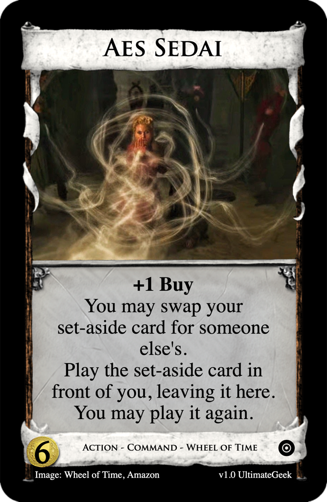

# Wheel of Time
Post: [Weekly Design Contest #148: Expand The Kingdom](http://forum.dominionstrategy.com/index.php?topic=21168.0)
by Commodore Chuckles, 2022 April 5

> Your challenge this week is to design something that introduces at least one additional Kingdom card into the game. Examples would be **Black Market**, **Young Witch** and **Way Of The Mouse**.

## Submission: Wheel of Time - a rotating split pile

> Rule: Wheel of Time cards may only play and rotate the Action cards  
> set aside during setup in front of each player.

### [$3 Action - Bowl of the Winds](https://shardofhonor.github.io/dominion-card-generator/index.html?title=Bowl%20of%20the%20Winds&description=Play%20the%20set-aside%20card%20in%20front%20of%20you%2C%20leaving%20it%20here.%0AYou%20may%20rotate%20the%20Wheel%20of%20Time%20pile.%0A-%0ASetup%3A%20Set%20aside%20a%20different%20unused%20Action%20in%20front%20of%20each%20player.%0A&type=Action%20-%20Command%20-%20Wheel%20of%20Time&credit=Art%3A%20Julie%20Bell&creator=v1.0%20UltimateGeek&price=%243&preview=&type2=&color2split=1&boldkeys=&picture-x=-0.06&picture-y=-1&picture-zoom=1&picture=https%3A%2F%2Fstatic.wikia.nocookie.net%2Fwot%2Fimages%2F7%2F7b%2FBowl_of_the_Winds.jpg&expansion=https%3A%2F%2Fcdn4.iconfinder.com%2Fdata%2Ficons%2Fionicons%2F512%2Ficon-disc-512.png&custom-icon=&color0=0&color1=0&size=0)

> Play the set-aside card in front of you, leaving it here.  
> You may rotate the Wheel of Time pile.  
> -  
> Setup: Set aside a different unused Action in front of each player.  

### [$4 Action - Saidin](https://shardofhonor.github.io/dominion-card-generator/index.html?title=Saidin&description=%2B1%20Action%0APlay%20the%20set-aside%20card%20in%20front%20of%20you%2C%20leaving%20it%20here.%0ARotate%20the%20set-aside%20cards%20clockwise.%0A%0A&type=Action%20-%20Command%20-%20Wheel%20of%20Time&credit=Art%3A%20Awynt%20Fritz&creator=v1.0%20UltimateGeek&price=%244&preview=&type2=&color2split=1&boldkeys=&picture-x=-0.06&picture-y=0.35&picture-zoom=1.1&picture=https%3A%2F%2F64.media.tumblr.com%2F44e7904d15a9b6a3d4f270b176dfe560%2Ftumblr_mj21r6szIf1s58mo8o1_1280.jpg&expansion=https%3A%2F%2Fcdn4.iconfinder.com%2Fdata%2Ficons%2Fionicons%2F512%2Ficon-disc-512.png&custom-icon=&color0=0&color1=0&size=0)

> +1 Action  
> Play the set-aside card in front of you, leaving it here.  
> Rotate the set-aside cards clockwise.

### [$5 Action - Saidar](https://shardofhonor.github.io/dominion-card-generator/index.html?title=Saidar&description=%2B%242%0APlay%20the%20set-aside%20card%20in%20front%20of%20you%2C%20leaving%20it%20here.%0ARotate%20the%20set-aside%20cards%20counterclockwise.&type=Action%20-%20Command%20-%20Wheel%20of%20Time&credit=Art%3A%20Jieroque&creator=v1.0%20UltimateGeek&price=%245&preview=&type2=&color2split=1&boldkeys=&picture-x=-0.06&picture-y=-0.61&picture-zoom=1.1&picture=https%3A%2F%2Fimages-wixmp-ed30a86b8c4ca887773594c2.wixmp.com%2Ff%2Fffd42000-bbb4-4c09-a8e8-7da63805efd5%2Fd5jmbtv-256c672f-6f55-4976-b4e8-5b7484f160ff.jpg%2Fv1%2Ffill%2Fw_1024%2Ch_634%2Cq_75%2Cstrp%2Fthe_flame_of_tar_valon_by_jieroque_d5jmbtv-fullview.jpg%3Ftoken%3DeyJ0eXAiOiJKV1QiLCJhbGciOiJIUzI1NiJ9.eyJzdWIiOiJ1cm46YXBwOjdlMGQxODg5ODIyNjQzNzNhNWYwZDQxNWVhMGQyNmUwIiwiaXNzIjoidXJuOmFwcDo3ZTBkMTg4OTgyMjY0MzczYTVmMGQ0MTVlYTBkMjZlMCIsIm9iaiI6W1t7ImhlaWdodCI6Ijw9NjM0IiwicGF0aCI6IlwvZlwvZmZkNDIwMDAtYmJiNC00YzA5LWE4ZTgtN2RhNjM4MDVlZmQ1XC9kNWptYnR2LTI1NmM2NzJmLTZmNTUtNDk3Ni1iNGU4LTViNzQ4NGYxNjBmZi5qcGciLCJ3aWR0aCI6Ijw9MTAyNCJ9XV0sImF1ZCI6WyJ1cm46c2VydmljZTppbWFnZS5vcGVyYXRpb25zIl19.StKBlS1Xs6hO6FH1W23XLt33MGQfbRv-VKjD5OfaqBE&expansion=https%3A%2F%2Fcdn4.iconfinder.com%2Fdata%2Ficons%2Fionicons%2F512%2Ficon-disc-512.png&custom-icon=&color0=0&color1=0&size=0)

> +$2  
> Play the set-aside card in front of you, leaving it here.  
> Rotate the set-aside cards counterclockwise.

### [$6 Action - Aes Sedai](https://shardofhonor.github.io/dominion-card-generator/index.html?title=Aes%20Sedai&description=%2B1%20Buy%0AYou%20may%20swap%20your%20set-aside%20card%20for%20someone%20else%27s.%0APlay%20the%20set-aside%20card%20in%20front%20of%20you%2C%20leaving%20it%20here.%0AYou%20may%20play%20it%20again.&type=Action%20-%20Command%20-%20Wheel%20of%20Time&credit=Image%3A%20Wheel%20of%20Time%2C%20Amazon&creator=v1.0%20UltimateGeek&price=%246&preview=&type2=&color2split=1&boldkeys=&picture-x=-0.06&picture-y=0.22&picture-zoom=1.3&picture=https%3A%2F%2Fi.ytimg.com%2Fvi%2Fd9aHElOTcYg%2Fmaxresdefault.jpg&expansion=https%3A%2F%2Fcdn4.iconfinder.com%2Fdata%2Ficons%2Fionicons%2F512%2Ficon-disc-512.png&custom-icon=&color0=0&color1=0&size=0)

> +1 Buy  
> You may swap your set-aside card for someone else's.  
> Play the set-aside card in front of you, leaving it here.  
> You may play it again.

