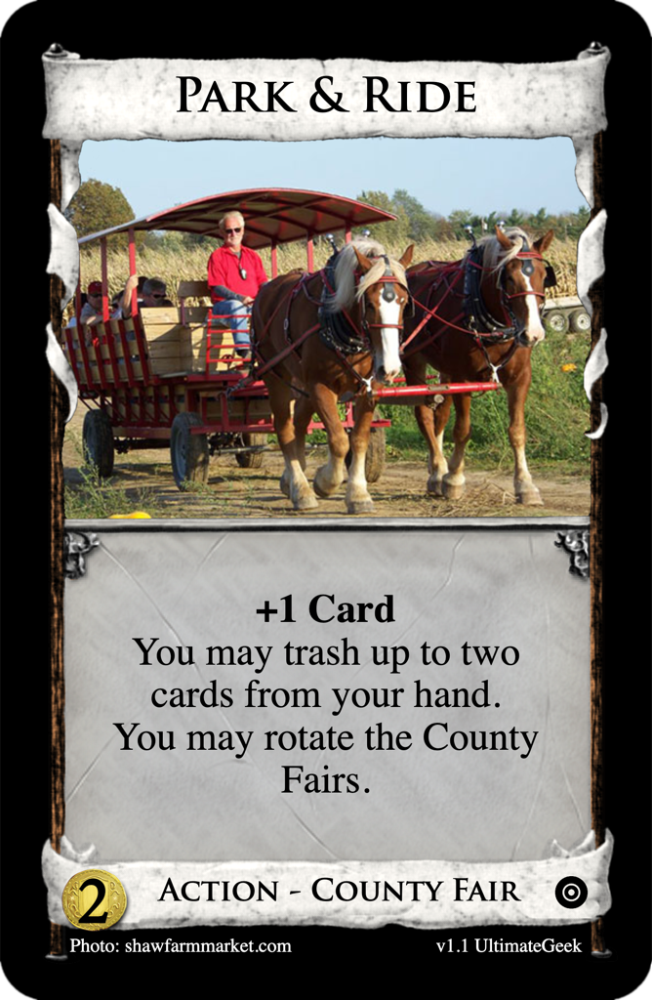
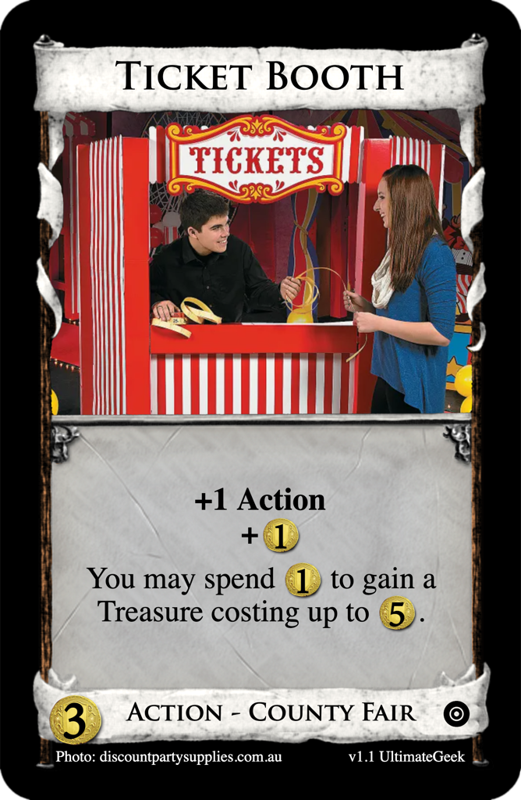
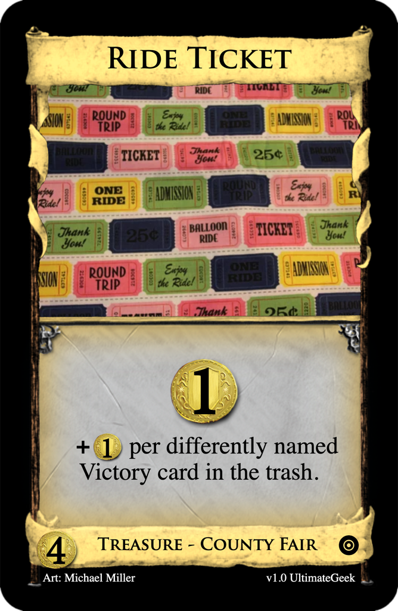
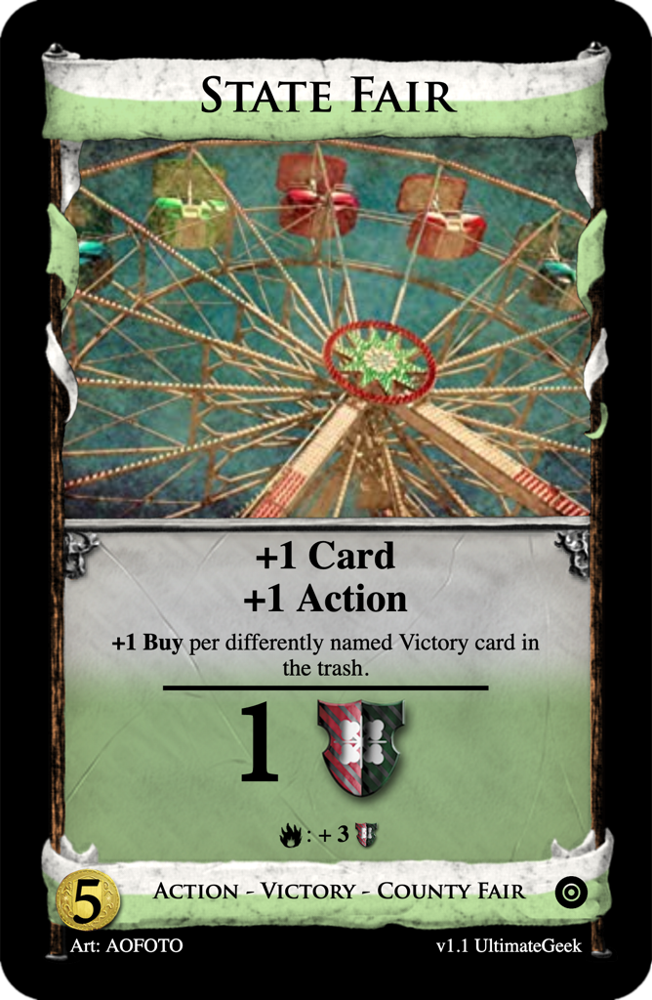

# Fan Mechanics
Submissions to the Dominion Strategy Forum board
[Variants and Fan Cards](http://forum.dominionstrategy.com/index.php?board=11.0).

Newest submissions are listed first.

## ReAlly?
[Never-ending thread by infangthief, 2022 March 4](http://forum.dominionstrategy.com/index.php?topic=21100.0)

> So these could go in the RBCI thread. But to go in this thread your Ally has to end in "-ally".
>
> **EventuAlly**: When you play a Lich, you may spend a Favor to replay it. Repeat as desired.
>
> **BrutAlly**: At the start of Clean-up, you may spend a Favor to gain a Possession from the Supply or the box.
>
> **ActuAlly**: You may spend a Favor to undo your last decision.
>
> **GlobAlly**: At the start of your turn, you may spend a Favor to have the number of Actions, Coins and Buys that the player to your right had at the end of their last buy phase.
>
> **TAlly**: At the start of the game, you may spend a Favor to keep track of your score on your belly with their own blood this game.

### PenAlly
**PenAlly**: When another player makes a mistake and starts to move onto playing a buying another card, you may point out their mistake and spend a Favor to have the game continue without any undos and choose one: end their turn abruptly, they trash one of their cards in play that you choose, you get +1VP, or you gain a Gold.

## Fan Mechanics Week #33: Trial By Fire
Design a card that uses a "burn" mechanic where you can trash a card
in play for the listed benefit any time during your turn.

### [County Fairs](county-fairs)

