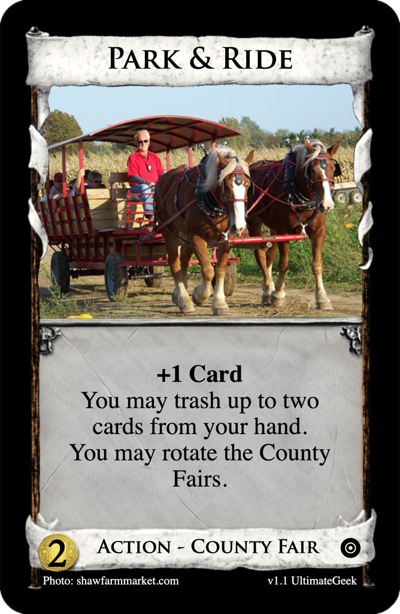
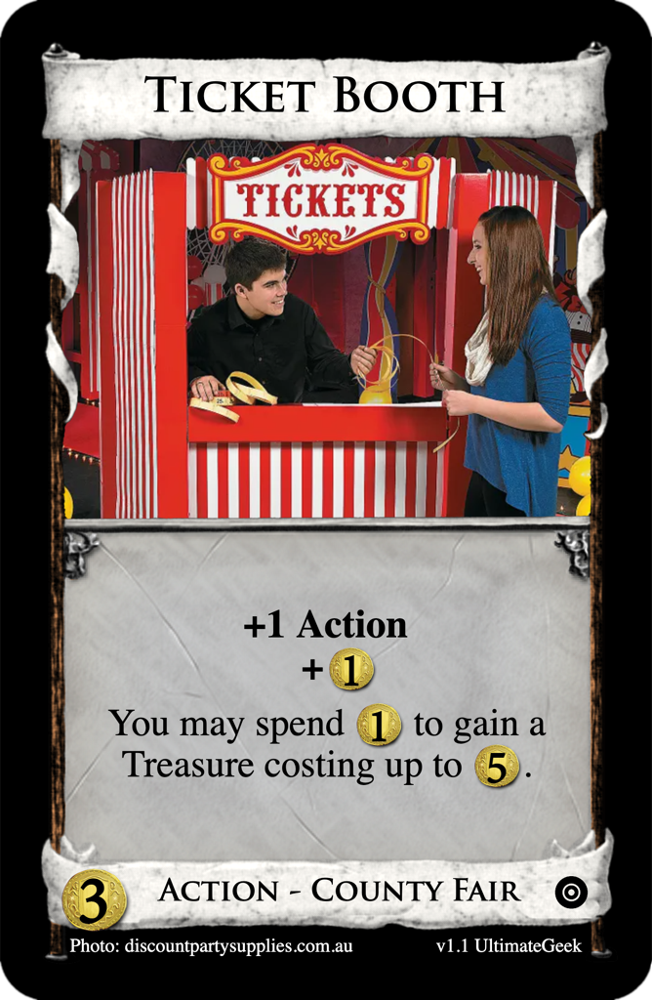

# County Fairs
Forum post: [County Fairs - a rotating split pile](http://forum.dominionstrategy.com/index.php?topic=21157.msg890070#msg890070)

## [$2 Action - County Fair: Park & Ride](https://shardofhonor.github.io/dominion-card-generator/index.html?title=Park%20%26%20Ride&description=%2B1%20Card%0AYou%20may%20trash%20up%20to%20two%20cards%20from%20your%20hand.%0AYou%20may%20rotate%20the%20County%20Fairs.&type=Action%20-%20County%20Fair&credit=Photo%3A%20shawfarmmarket.com&creator=v1.1%20UltimateGeek&price=%242&preview=&type2=&color2split=1&boldkeys=&picture-x=1&picture-y=-0.23&picture-zoom=1&picture=https%3A%2F%2Fshawfarmmarket.com%2Fcontent%2Fmedia%2FFallHayrides%2FHayrideHorseDrawn1.jpg&expansion=https%3A%2F%2Fcdn4.iconfinder.com%2Fdata%2Ficons%2Fionicons%2F512%2Ficon-disc-512.png&custom-icon=&color0=0&color1=0&size=0)

> +1 Card  
> You may trash up to two cards from your hand.  
> You may rotate the County Fairs.  

## [$3 Action - County Fair: Ticket Booth](https://shardofhonor.github.io/dominion-card-generator/index.html?title=Ticket%20Booth&description=%2B1%20Action%0A%2B%241%0A%0AYou%20may%20spend%20%241%20to%20gain%20a%20Treasure%20costing%20up%20to%20%245.&type=Action%20-%20County%20Fair&credit=Photo%3A%20discountpartysupplies.com.au&creator=v1.1%20UltimateGeek&price=%243&preview=&type2=&color2split=1&boldkeys=&picture-x=-0.06&picture-y=0.67&picture-zoom=1.2&picture=https%3A%2F%2Fwww.discountpartysupplies.com.au%2Fmedia%2Fcatalog%2Fproduct%2Fc%2Fi%2Fcirdepp04_2_.jpg%3Fquality%3D80%26bg-color%3D255%2C255%2C255%26fit%3Dbounds%26height%3D700%26width%3D700%26canvas%3D700%3A700&expansion=https%3A%2F%2Fcdn4.iconfinder.com%2Fdata%2Ficons%2Fionicons%2F512%2Ficon-disc-512.png&custom-icon=&color0=0&color1=0&size=0)

> +1 Action  
> +$1
>
> You may spend $1 to gain a Treasure costing up to $5.

## [$4 Treasure - County Fair: Ride Ticket](https://shardofhonor.github.io/dominion-card-generator/index.html?title=Ride%20Ticket&description=%241%0A%2B%241%20per%20differently%20named%20Victory%20card%20in%20the%20trash.%0A&type=Treasure%20-%20County%20Fair&credit=Art%3A%20Michael%20Miller&creator=v1.0%20UltimateGeek&price=%244&preview=&type2=&color2split=1&boldkeys=&picture-x=-0.06&picture-y=0.67&picture-zoom=1.2&picture=https%3A%2F%2Fi.etsystatic.com%2F17695223%2Fr%2Fil%2F236309%2F2435910985%2Fil_570xN.2435910985_8gza.jpg&expansion=https%3A%2F%2Fcdn4.iconfinder.com%2Fdata%2Ficons%2Fionicons%2F512%2Ficon-disc-512.png&custom-icon=&color0=1&color1=0&size=0)

> +$1  
> +$1 per differently named Victory card in the trash.

## [$5 Victory - Action - County Fair: State Fair](https://shardofhonor.github.io/dominion-card-generator/index.html?title=State%20Fair&description=%2B1%20Card%0A%2B1%20Action%0A%2B1%20Buy%20per%20differently%20named%20Victory%20card%20in%20the%20trash.%0A-%0A1%25%0A%C2%A7%3A%20%2B%203%25&type=Action%20-%20Victory%20-%20County%20Fair&credit=Art%3A%20AOFOTO&creator=v1.1%20UltimateGeek&price=%245&preview=&type2=&color2split=1&boldkeys=&picture-x=-0.06&picture-y=-0.08&picture-zoom=1.1&picture=https%3A%2F%2Fm.media-amazon.com%2Fimages%2FI%2F71sQwhDGV1L._AC_SX355_.jpg&expansion=https%3A%2F%2Fcdn4.iconfinder.com%2Fdata%2Ficons%2Fionicons%2F512%2Ficon-disc-512.png&custom-icon=https%3A%2F%2Ftrello.com%2F1%2Fcards%2F6242c46dc5dc0c3b8828597f%2Fattachments%2F6242c5cc879b28274e5427e2%2Fdownload%2FBurnAbilityIcon.png&color0=2&color1=1&size=0)

> +1 Card  
> +1 Action  
> +1 Buy per differently named Victory card in the trash.  
> --  
> 1%  
> §: + 3%

