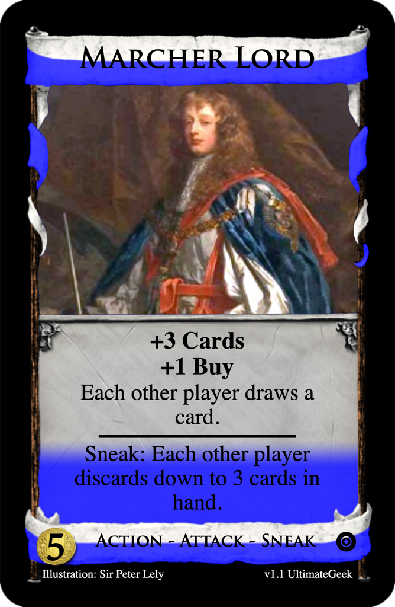

# Marcher Lord
Post: [Fan Mechanics Week #35: Getting Sneaky](http://forum.dominionstrategy.com/index.php?topic=21187.0)
by Commodore Chuckles, 2022 April 20

> This contest involves a mechanic I am developing called *Sneak*. This is the same as the Jackpot ability I wrote about a while ago, but I'm changing its name in order to better fit with a new theme for a new set I want to make.
>
> Sneak is an ability that you can use *any time on your turn other than clean-up, but only once per turn*. It can be used before resolving beginning-of-turn effects, in the Night phase, or any time in between. When a card has the Sneak type, it means you can play it using its Sneak ability, indicated by the text "Sneak:", instead of its regular ability. So, if a card has both the Sneak and Action types, it means that once per turn, you're allowed to play the card at any time using its Sneak ability, but then any other plays of the card (or copies of it) have to be in the Action phase, using its Action ability. The Sneak type is indicated by a dark blue color, and Sneak - Action cards should have both colors.
>
> ...
>
> Things to keep in mind overall are all the different phases that the Sneak can be used in, as well as the fact that it allows things that would break the game if they could be used more than once per turn.
>
> Also, I'd like some feedback on how well you think this mechanic works overall. My main concern is boards with more than one Sneak card on them. It seems possible that, because of the once per turn restriction, one of the Sneak cards would end up with only its plain ability being used. I thought about making the restriction instead "once per turn per pile", but that seems too complicated. Does anyone have any other ideas?

## Submission: [$5 Action - Attack - Sneak: Marcher Lord](https://shardofhonor.github.io/dominion-card-generator/?title=Marcher%20Lord&description=%2B3%20Cards%0A%2B1%20Buy%0AEach%20other%20player%20draws%20a%20card.%0A-%0ASneak%3A%20Each%20other%20player%20discards%20down%20to%203%20cards%20in%20hand.&type=Action%20-%20Attack%20-%20Sneak&credit=Illustration%3A%20Sir%20Peter%20Lely&creator=v1.1%20UltimateGeek&price=%245&preview=&type2=&color2split=19&boldkeys=&picture-x=-0.79&picture-y=0.74&picture-zoom=1.2&picture=https%3A%2F%2Fupload.wikimedia.org%2Fwikipedia%2Fcommons%2F2%2F28%2FPeter_Lely_Charles_Stewart_3rd_Duke_of_Richmond.jpg&expansion=https%3A%2F%2Fcdn4.iconfinder.com%2Fdata%2Ficons%2Fionicons%2F512%2Ficon-disc-512.png&custom-icon=&c0.0=0.25&c0.1=0.25&c0.2=10&color1=1&size=0)

> +3 Cards  
> +1 Buy  
> Each other player draws a card.
> ____
>
> Sneak: Each other player discards down to 3 cards in hand.

## Review
by Commodore Chuckles

> Fun fact: My Jackpot thread had this exact same card, but with a different name. Great minds think alike, I guess. So yeah, the fact that I already came up with this idea is a good indication that I like it. The main struggle I had, and still have, with the idea is that it's difficult to balance. If there are no Villages, then you can play a maximum of two of these, and since the Sneak play decreases your hand size, then you only managed to increase your hand size by one overall. Of course, Ghost Ship is an official card that only gives you one extra card while decreasing everyone else's hands, but... it's also one of the most hated cards in the game. I guess only playtesting could tell if this idea is actually fun.
