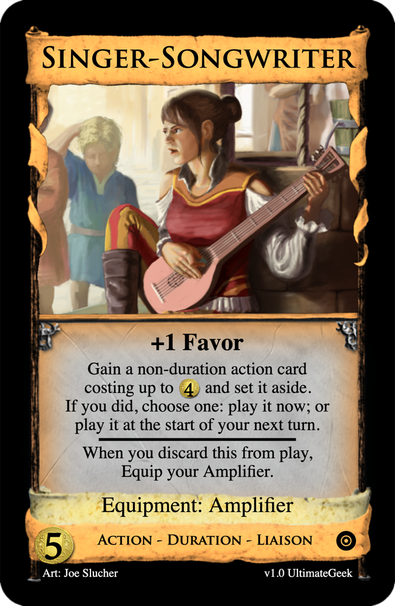
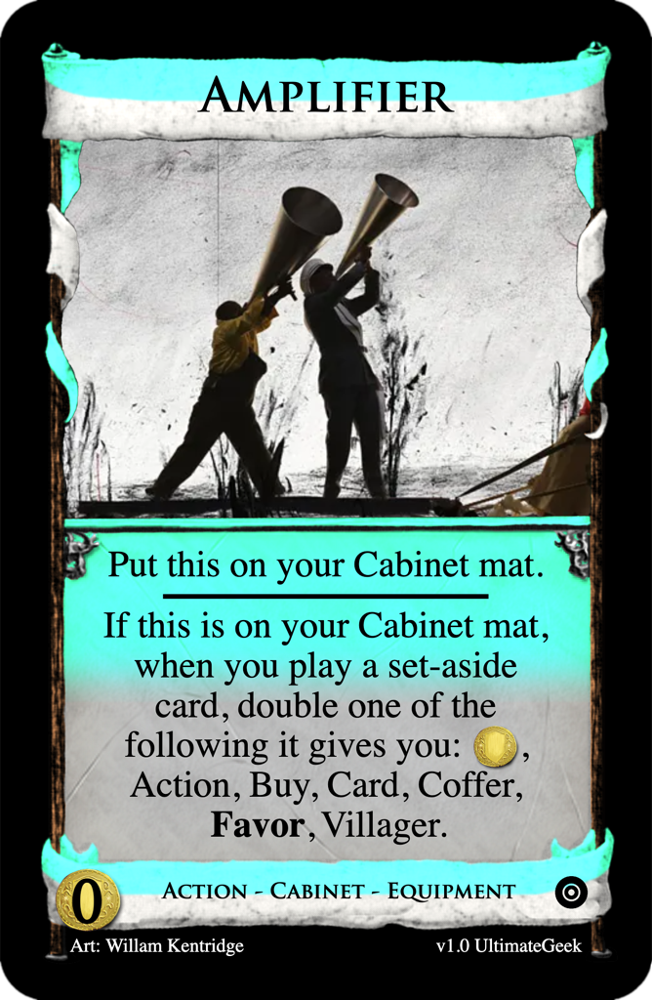

# Singer-Songwriter
Post: [Fan Mechanics Week #34: Equipment](http://forum.dominionstrategy.com/index.php?topic=21176.0)
by LibraryAdventurer, 2022 April 9

> So... Let's use a mechanic by gambit05 that I thought was interesting, [Equipment Cards](http://forum.dominionstrategy.com/index.php?topic=20732.0).  
> From his post:  
> ...  
> Take a look at his thread for some examples.

## Submission: Singer-Songwriter

### [$5 Action - Duration - Liaison: Singer-Songwriter](https://shardofhonor.github.io/dominion-card-generator/?title=Singer-Songwriter&description=%2B1%20Favor%0AGain%20a%20non-duration%20action%20card%20costing%20up%20to%20%244%20and%20set%20it%20aside.%0AIf%20you%20did%2C%20choose%20one%3A%20play%20it%20now%3B%20or%20play%20it%20at%20the%20start%20of%20your%20next%20turn.%0A-%0AWhen%20you%20discard%20this%20from%20play%2C%20Equip%20your%20Amplifier.&type=Action%20-%20Duration%20-%20Liaison&credit=Art%3A%20Joe%20Slucher&creator=v1.0%20UltimateGeek&price=%245&preview=&type2=Equipment%3A%20Amplifier&color2split=1&boldkeys=&picture-x=-0.32&picture-y=0.67&picture-zoom=1.2&picture=https%3A%2F%2Fimages-wixmp-ed30a86b8c4ca887773594c2.wixmp.com%2Ff%2F8aa49384-0665-4b6e-8894-22d0487e4f82%2Fd72aayg-18045298-52ac-4873-9870-351de637a340.jpg%3Ftoken%3DeyJ0eXAiOiJKV1QiLCJhbGciOiJIUzI1NiJ9.eyJzdWIiOiJ1cm46YXBwOjdlMGQxODg5ODIyNjQzNzNhNWYwZDQxNWVhMGQyNmUwIiwiaXNzIjoidXJuOmFwcDo3ZTBkMTg4OTgyMjY0MzczYTVmMGQ0MTVlYTBkMjZlMCIsIm9iaiI6W1t7InBhdGgiOiJcL2ZcLzhhYTQ5Mzg0LTA2NjUtNGI2ZS04ODk0LTIyZDA0ODdlNGY4MlwvZDcyYWF5Zy0xODA0NTI5OC01MmFjLTQ4NzMtOTg3MC0zNTFkZTYzN2EzNDAuanBnIn1dXSwiYXVkIjpbInVybjpzZXJ2aWNlOmZpbGUuZG93bmxvYWQiXX0.a9ja4Q91r0YqbV6g7ZKEQWYjyLOYiNT9lC4f94WF3X0&expansion=https%3A%2F%2Fcdn4.iconfinder.com%2Fdata%2Ficons%2Fionicons%2F512%2Ficon-disc-512.png&custom-icon=&color0=4&color1=0&size=0)

> +1 Favor  
> Gain a non-duration action card costing up to $4 and set it aside.  
> If you did, choose one: play it now; or play it at the start of your next turn.  
> -  
> When you discard this from play, Equip your Amplifier.
>
> Equipment: Amplifier

### [$0 Action - Cabinet - Equipment: Amplifier](https://shardofhonor.github.io/dominion-card-generator/?title=Amplifier&description=Put%20this%20on%20your%20Cabinet%20mat.%0A-%0AIf%20this%20is%20on%20your%20Cabinet%20mat%2C%20when%20you%20play%20a%20set-aside%20card%2C%20double%20one%20of%20the%20following%20it%20gives%20you%3A%20%24%2C%20Action%2C%20Buy%2C%20Card%2C%20Coffer%2C%20Favor%2C%20Villager.&type=Action%20-%20Cabinet%20-%20Equipment&credit=Art%3A%20Willam%20Kentridge&creator=v1.0%20UltimateGeek&price=%240&preview=&type2=&color2split=1&boldkeys=&picture-x=1&picture-y=0.67&picture-zoom=1.2&picture=https%3A%2F%2Fi.guim.co.uk%2Fimg%2Fstatic%2Fsys-images%2FGuardian%2FPix%2Fpictures%2F2015%2F9%2F9%2F1441798027337%2FKentridge-009.jpg%3Fwidth%3D620%26quality%3D85%26auto%3Dformat%26fit%3Dmax%26s%3Deb3d562b2fdcec4c43a432ddc5006d02&expansion=https%3A%2F%2Fcdn4.iconfinder.com%2Fdata%2Ficons%2Fionicons%2F512%2Ficon-disc-512.png&custom-icon=&color0=0&c1.0=0.5&c1.1=1.75&c1.2=1.3&size=0)

> Put this on your Cabinet mat.
> -
> If this is on your Cabinet mat, when you play a set-aside card, double one of the following it gives you: $, Action, Buy, Card, Coffer, Favor, Villager.

